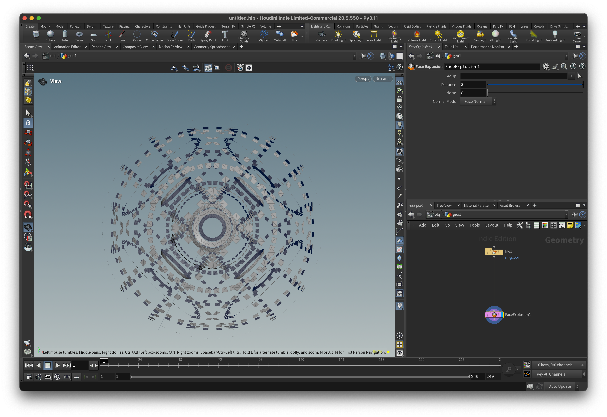

# Houdini - Face Explosion
Small code exercise in using Houdini SDK (HDK)

*Face Explosion* is a simple Houdini SOP node for transforming input mesh faces along their normal vector.

---

---

# Choosing The Right Normal Mode

Face explosion can follow the direction of face normal or radial normal based on position of the face relatively to
the center of the model.

| Input | Face Normals | Radial Normals |
| :---: | :----------: | :------------: |
|  |  |  |
|  |  |  |

---

